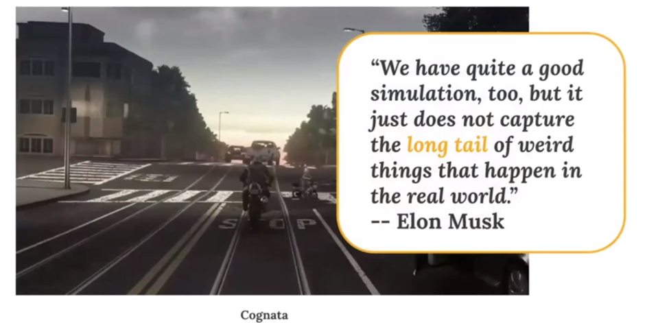
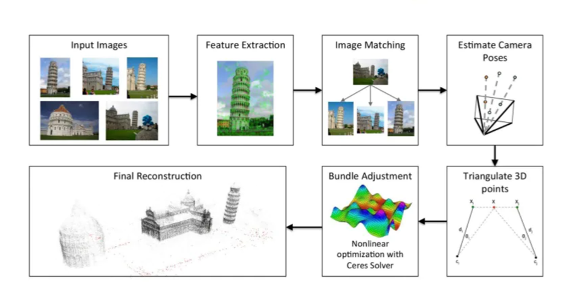
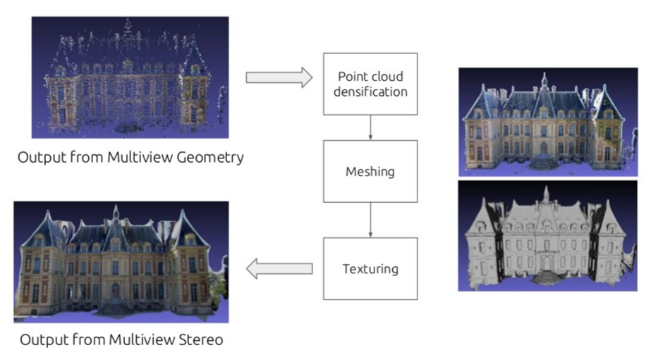

## Point Clouds and 3D modeling

<!-- You can use the [editor on GitHub](https://github.com/AlejandrinaJimenez/Point-Clouds-and-Deformable-Meshes-for-3D-modeling/edit/main/README.md) to maintain and preview the content for your website in Markdown files.

Whenever you commit to this repository, GitHub Pages will run [Jekyll](https://jekyllrb.com/) to rebuild the pages in your site, from the content in your Markdown files. -->

### Introduction
This project aims to explore the applications of geometry in Machine learning by implementing two papers that are under the umbrella of Geometric Deep Learning and focus on the topics of 3D modeling using point clouds and meshes. Originally, I decided that I was going to set up a website that would let the users upload a 2D image and show the process of converting it to a 3D object. However, due to some challenges that I will explaing more in a future section, I decided to focus on the pipeline that deals only with point clouds to 3D objects and explain the whole process showing how the final object is generated. 

<!-- Markdown is a lightweight and easy-to-use syntax for styling your writing. It includes conventions for

```markdown
Syntax highlighted code block

# Header 1
## Header 2
### Header 3

- Bulleted
- List

1. Numbered
2. List

**Bold** and _Italic_ and `Code` text

[Link](url) and 
```

For more details see [Basic writing and formatting syntax](https://docs.github.com/en/github/writing-on-github/getting-started-with-writing-and-formatting-on-github/basic-writing-and-formatting-syntax).
 -->
### Background
#### 3D modeling and its applications
Basically, the main goal of 3D reconstructon is to obtain the geometric properties of a scene by processing and combining visual cues from a set of views(like in the image below). We can recover infromation about the surface, poses, illumination, and others, but for this project we will just focus on surfaces. 


There are a lot of applications which may benefit from 3d reconstruction algorithms as shown in this graph. 


For example, it can help with visual navegation systems to generate data for self driving cars. Companies are trying to create rich and complex 3D simulated environments that will cover all possible scenarios on the road. However, it still has its challenges because it is not easy to learn all of the different types of unpredictable and extraordinary scenarios in the long tail. 



#### Classical Geometric Methods for 3D modeling
1. Multiview Geometry:
This is the classical pipeline based on geometry. First we need to detect some features in the input images, then we extract some descriptors on those images and match them, for example using RANSAC or a similar robust matching algorithm. With these correspondences we can triangulate them and know where the points are in 3D. After we have our triangulation, we need to refine the approximated 3D positions, using a nonlinear optimization called Bundle Adjustment, this will help us refine the 3D positions. Finally, we end up with a point cloud which is the point representation of a 3D shape or object. This process is represented in the following figure: 



2. Multiview Stereo:
In this method we strart with a point cloud densification, basically if we have a set of images and sparse correspondences, we find the correspondences on images an then triangulate. 
The next step is mesh reconstruction for estimating a mesh surface that explains best the input point-cloud, we also perform mesh refinement for recovering all fine details. Finally, mainly for visualization purposes, mesh texturing is performed for computing a sharp and accurate texture to color the mesh.



### Jekyll Themes

Your Pages site will use the layout and styles from the Jekyll theme you have selected in your [repository settings](https://github.com/AlejandrinaJimenez/Point-Clouds-and-Deformable-Meshes-for-3D-modeling/settings/pages). The name of this theme is saved in the Jekyll `_config.yml` configuration file.

### Support or Contact

Having trouble with Pages? Check out our [documentation](https://docs.github.com/categories/github-pages-basics/) or [contact support](https://support.github.com/contact) and we’ll help you sort it out.
