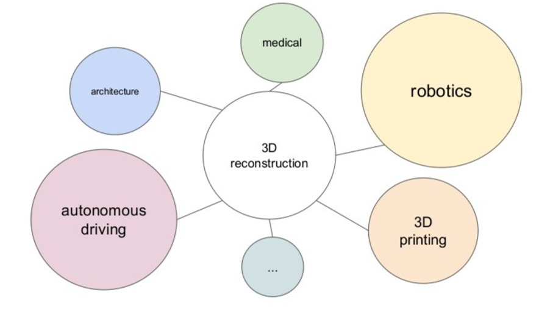

## Point Clouds and 3D modeling

<!-- You can use the [editor on GitHub](https://github.com/AlejandrinaJimenez/Point-Clouds-and-Deformable-Meshes-for-3D-modeling/edit/main/README.md) to maintain and preview the content for your website in Markdown files.

Whenever you commit to this repository, GitHub Pages will run [Jekyll](https://jekyllrb.com/) to rebuild the pages in your site, from the content in your Markdown files. -->

### Introduction
This project aims to explore the applications of geometry in Machine learning by implementing two papers that are under the umbrella of Geometric Deep Learning and focus on the topics of 3D modeling using point clouds and meshes. Originally, I decided that I was going to set up a website that would let the users upload a 2D image and show the process of converting it to a 3D object. However, due to some challenges that I will explaing more in a future section, I decided to focus on the pipeline that deals only with point clouds to 3D objects and explain the whole process showing how the final object is generated. 

<!-- Markdown is a lightweight and easy-to-use syntax for styling your writing. It includes conventions for

```markdown
Syntax highlighted code block

# Header 1
## Header 2
### Header 3

- Bulleted
- List

1. Numbered
2. List

**Bold** and _Italic_ and `Code` text

[Link](url) and 
```

For more details see [Basic writing and formatting syntax](https://docs.github.com/en/github/writing-on-github/getting-started-with-writing-and-formatting-on-github/basic-writing-and-formatting-syntax).
 -->
### Background
#### 3D modeling and its applications
Basically, the main goal of 3D reconstructon is to obtain the geometric properties of a scene by processing and combining visual cues from a set of views(like in the image below). We can recover infromation about the surface, poses, illumination, and others, but for this project we will just focus on surfaces. 


There are a lot of applications which may benefit from 3d reconstruction algorithms as shown in this graph. 



For example, it can help with visual navegation systems to generate data for self driving cars. Companies are trying to create rich and complex 3D simulated environments that will cover all possible scenarios on the road. However, it still has its challenges because it is not easy to learn all of the different types of unpredictable and extraordinary scenarios in the long tail. 


#### Classical Geometric Methods for 3D modeling
1. Multiview Geometry:
This is the classical pipeline based on geometry. First we need to detect some features in the input images, then we extract some descriptors on those images and match them, for example using RANSAC or a similar robust matching algorithm. With these correspondences we can triangulate them and know where the points are in 3D. After we have our triangulation, we need to refine the approximated 3D positions, using a nonlinear optimization called Bundle Adjustment, this will help us refine the 3D positions. Finally, we end up with a point cloud which is the point representation of a 3D shape or object. This process is represented in the following figure: 


2. Multiview Stereo:
In this method we strart with a point cloud densification, basically if we have a set of images and sparse correspondences, we find the correspondences on images an then triangulate. 
The next step is mesh reconstruction for estimating a mesh surface that explains best the input point-cloud, we also perform mesh refinement for recovering all fine details. Finally, mainly for visualization purposes, mesh texturing is performed for computing a sharp and accurate texture to color the mesh.


#### Limitations of classical methods:
* If images do not overlap enough, we will end up with different 3d reconstructions that will not look like a whole object. 
* If we have reflective surfaces, we will not be able to extract points so we cannot triangulate.
* Pure rotations: if we have a camera that is always in the same point we cannot triangulate, because we need two positions to triangulate a point, if we are only rotating we cannot properly triangulate. 
* Repeated structures: if we need to compute matches, repeated structures will confuse the matches because of the similarity. 
* Non Lambertian surfaces.

### Deep Learning Approach
* With deep learning we can help with the descriptor: we have convolutional networks that are extracting very powerful representations of the images, so with better descriptors we can have better matchings.
* Since we have seen many scenes, we have some prior knowledge encoded in our system, therefore this can help reconstruct a surface from a fewer number of images.
 
The problem is to estimate the function f from a set of images we would like to map to a surface. Here we are not working with a plane anymore, but with surfaces that could be thought as planes that have a curvature different than zero. So we have some stretching and dilations therefore the space is non Euclidean anymore, and in principle we cannot use the standard convolution to model them.


### Methods
For this project I focused on 2 methods presented in different papers:
* [PointOutNet](https://arxiv.org/pdf/1612.00603.pdf) : 


In this work the Fan et al.  model the surface as a set of of points (Point Cloud) in two channels, the first one is the channel of the pink nodes (check the image below) that are convolutions which are arranged in a way that is encoder-decoder. They model a hourgalss network which has the estructure of encoders decoders concatenated and with skip connections.


Also they wanted to model this as a generative model instead of just a predictor and they  defined a loss that models that which is the Minimum of N, which is just wrapping the loss that they are using with minimum of n, and for this case it works quite well. And they also modeled it with a conditional variational auto encoder.   
The results are in the following image, compared to other methods, we can see that although it keeps the structure of the object it lacks detail, and is single view and requires some post- porcessing. 


* [Point2Mesh](https://arxiv.org/pdf/2005.11084.pdf):  


This is a technique for reconstructing a surface mesh from an input point cloud. This approach "learns" from a single object, by optimizing the weights of a CNN to deform some initial mesh to shrink-wrap the input point cloud. A deformable mesh wraps around a point cloud and iteratively learns its internal features to reconstruct a 3d object with more detail. 


The initial mesh is a coarse approximation of the point cloud. If the object has a genus of zero, we use the convex hull of the point cloud for the approximation. This is used as input to a CNN that predicts vertex displacements and applies them on the initial mesh, the deformed mesh is then passed to a differential sampler resulting in a sample mesh, then calculate the distance between the sample mesh and the input point cloud which is used to update the CNN weights.


## Results
### PointOutNet
The results obtained for this paper were not as good as expected, as we can apreciate from the pictures, the general structure of the image remains but it is not very clear. 


<!-- Your Pages site will use the layout and styles from the Jekyll theme you have selected in your [repository settings](https://github.com/AlejandrinaJimenez/Point-Clouds-and-Deformable-Meshes-for-3D-modeling/settings/pages). The name of this theme is saved in the Jekyll `_config.yml` configuration file. -->


### Support or Contact

Having trouble with Pages? Check out our or [contact support](https://support.github.com/contact) and we’ll help you sort it out.
